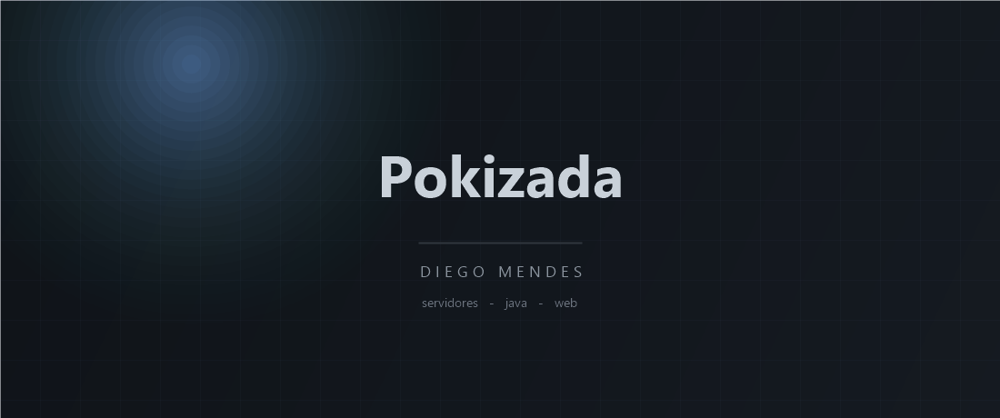

  

  

  
  
  

---

## Sobre

Sou o **Diego Mendes**, conhecido como **Pokizada**. Trabalho com infraestrutura e desenvolvimento, com foco em montar ambiente do zero e deixar tudo no ar — de servidores web a servidores de Minecraft.

| | |
|---|---|
| **Principal** | Configuro servidores do zero ao deploy — Linux, nginx e Docker |
| **Minecraft** | Servidores do zero: instalação, plugins, otimização e uptime |
| **Linguagem** | Java é a minha base, com HTML/CSS/JS para a parte web |
| **Como trabalho** | Do terminal para a produção, sem pular etapas |
| **Foco atual** | Projetos próprios e infraestrutura escalável |
| **Portfólio** | [pokizada.xyz](https://pokizada.xyz/) |

---

## Stack

  

  
  
  
  
  
  
  

---

## GitHub

  
  

  
  

  

  
  
  

---

## Atividade

  

  

---

## Destaques

  
  

  

---

## Contato

  
  
  

  <b>Diego Mendes</b> — Pokizada · 2026

